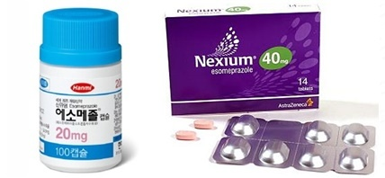
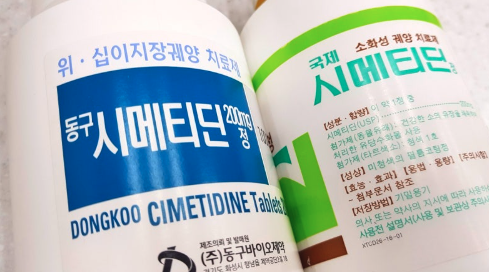
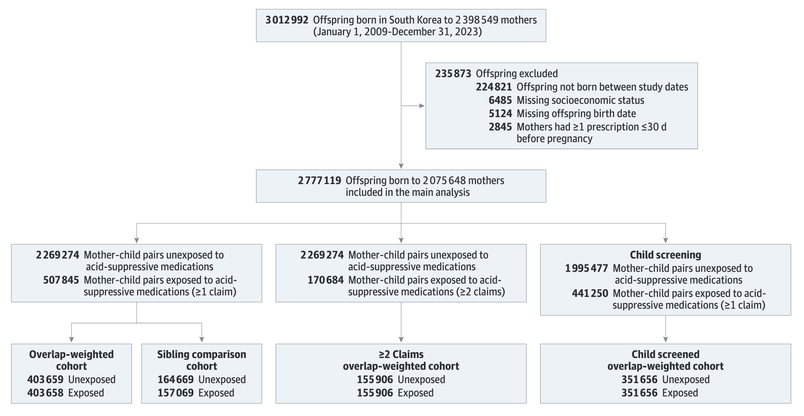
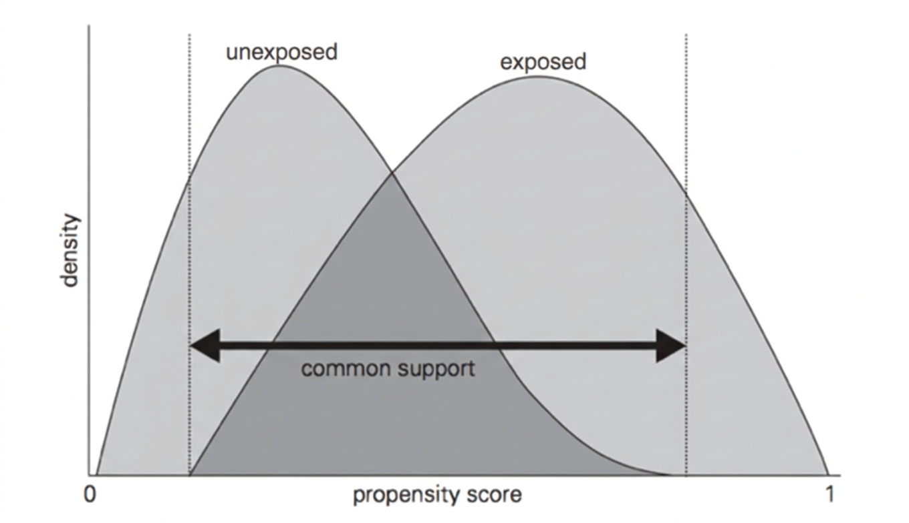
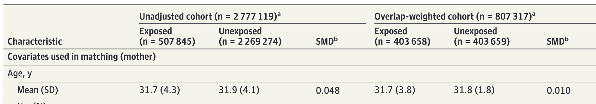
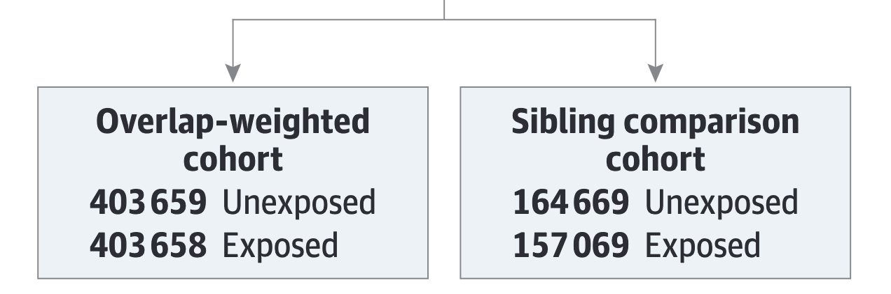
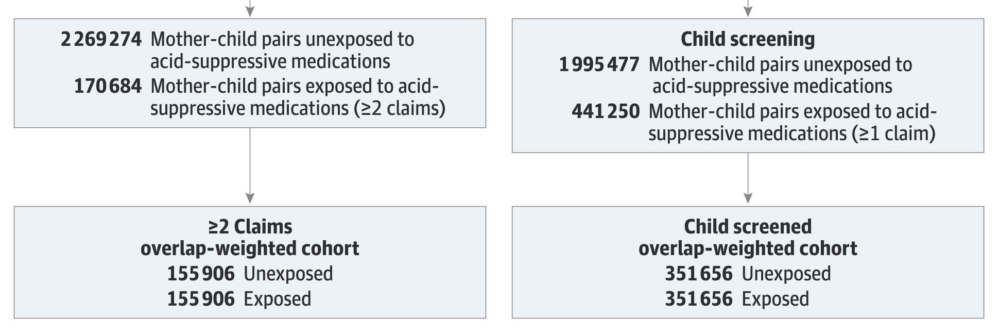

## Summary

산모의 **위산억제제 복용**이 자녀의 **신경정신질환 발생위험**과 연관이 있는가?

* **Population**: 2010.01-2017.12 에 출생한 모자 코호트 (NHIS)
* **Intervention**: 임신 중 위산억제제 처방
  + 프로톤 펌프 억제제(PPI), 
  + H2 수용체 길항제(H2 receptor antagonists)
* **Comparison**: 임신 중 위산억제제 처방받지 않음
* **Outcome**: 자녀 신경정신질환 발생
  + 중증 신경정신과적 장애(조현병 등),
  + 강박장애(obsessive-compulsive),
  + ADHD, 자폐(autism), 지적장애 등

## Introduction

* 그간 여러 연구에서 산모의 위산억제제[^1] 복용에 대한 유해성 제기
  + 조산, 알러지성 질환, 천식, 선천성 기형, 뇌전증(간질) 등 

* **태아의 신경계 발달**에 대한 유해성도 주목받음
  + 태아의 장내 미생물군은 뇌 신경망 형성에 주요한 역할 수행
  + 산모의 위산억제제 복용은 태아의 신경발달 프로세스에 영향을 미칠 수 있음

* 특히, 조산아의 2세 전 위산억제제 복용이 신경발달장애 위험증가와 관련이 있을 수 있다는 연구\
➡️ 동일한 매커니즘이 태아에게도 작동할 수 있음에 우려 대두
  + 산모가 복용하는 PPIs, H2 receptor antagonists는 태반장벽 통과 가능

[^1]: PPIs and H2 receptor antagonists

---

* 위산억제제는 임신 중 속쓰림과 위식도역류 증상에 대해 매우 흔히 처방됨\
➡️ 그러나 신경정신질환 발생위험과의 관계는 알려져 있지 않음

* 기존 연구는 조산, 알레르기, 천식 등과의 연관성은 제시했지만 신경정신질환에 대한 근거는 제한적이었음.

* **연구목적**\
  이에 전국단위 인구를 포괄하는 대규모 코호트 자료를 활용하여, 산모의 위산억제제와 자녀의 신경정신질환 발생위험 사이의 연관성을 밝힘

::: {layout-ncol=2}
{width=120%}

{width=80%}
:::

## Methods

### Data Source

* **데이터** 국민건강보험공단 전국규모(가입률 97%)의 모-자 연계 코호트\
  (2009.01.01-2023.12.31)
* **활용자료**
  * **Demographics**: 성별, 나이, 지역, 보험유형, 소득수준, 
  * **Clinical**: 진단코드(ICD-10), 진단일, 진료과 등
  * **Medical procedures**: 수술 및 비약물적 시술기록
  * **Prescription records**: 약물코드 & 투여방법(경로: 경구, 주사 등)
  * **Health care utilization**: 입원 or 외래
  * **Infant screening**: 출생 체중, 조산여부 등

---

### Study Population

* (**연구대상**) 2010.01.01-2017.12.31 사이에 출산한 13-58세 여성
  + 산모는 임신 12개월 전까지 관찰(look-back),
  + 자녀는 2023.12.31까지 추적(follow-up)

* (**제외**) 임신 **전** 30일 내에 위산억제제 복용한 산모[^2], 자료누락 등

* (**최종**) 2,777,119명의 자녀(어머니 2,075,648명) 모-자 연계데이터
  + (**위산억제제 1회이상 노출군**) 507,845명
  + (**2회이상 노출군**) 170,684명 (민감도 분석 1)
  + (**1회이상 노출군 & 기저질환 자녀제외**) 441,250명 (민감도 분석 2)

[^2]: 청구자료상 임신 전/후 날짜가 불특정하기 때문?(LMP?). 만성질환자에 의한 모델 bias 등을 최소화하고, 임신전 복용 효과가 임신후로 이어질 수 있어서 washout period를 갖기 위해?

---

::: {layout-ncol=1}
{fig-align="center"}
:::

---

### Outcome

ICD-10 코드를 활용하여, 출생 후 첫 진단을 onset으로 설정\

|구분|코드|
|:---|:---|
|심각한 신경정신 질환(조현병 등)|F20-24, F28-29, F25, F30-31, F32.3, F33.3|
|강박성 장애|F42|
|ADHD|F90|
|ASD (자폐)|F84.0, F84.1, F84.5, F84.8, F84.9|
|지적 장애|F70-F79|

---

### Covariates

추정식에 포함하여 Crude vs. Adjusted 분석결과 비교

|구분|변수 요약|
|:---|:---|
|산모 인구사회학적 특징|출산시 연령, 거주지, 소득 사분위수, 다자녀 여부|
|산모 임상적 특징|정신질환, 산전 질환 및 의료이용|
|출산 요인|분만 방법, 출산시 계절|
|자녀 요인|성별, 조산여부, 저체중 여부|

---

## Statistical Analysis

### Propensity-score-based overlap-weighted

* 산모의 위산억제제 복용은 무작위로 배정되지 않았음\
➡️ 단순비교가 어려움 (confounding)

* 통상적으로 모델에 covariate 포함시켜서 보정(Crude vs. Adjusted)\
➡️ covariate과 outcome 간에 선형성 가정 필요 and 차원의 저주
  
* covariate를 활용하여 **노출될 확률(PS)**을 계산하고, 이 노출될 확률이 비슷한 개체끼리 매칭하여 분석 (Propensity Score Matching)\
➡️ 차원의 저주 문제 완화 & 선형성 가정 회피, but\
➡️ **PS가 매우 높은 비노출군** 혹은 **PS가 매우 낮은 노출군**은 드물음\
➡️➡️ 이 드물은 케이스들이 모델에 영향을 주어 추정이 불안정해짐

**더 많은 케이스들이 모델추정에 더 많이 반영되도록 코호트 구성 필요**

---

* 노출군은 보통 PS가 높음 ➡️ PS가 아주 낮은 노출군은 드물음
* 비노출군은 보통 PS가 낮음 ➡️ PS가 아주 높은 비노출군은 드물음
* 공통된 부분에 더 많은 가중치를 주어 코호트 구성 필요
  + common support, i.e., overlap

{fig-align="center"}

---

* PS가 극단값이라면 ➡️ 가중치가 0에 가까워지도록, 
* PS가 0.5 ➡️ 가중치가 가장 커지도록 구성

$$
w_i=
\begin{cases}
노출군:1-PS\\
비노출군:PS
\end{cases}
$$

**일반 코호트(unadjusted)와 가중된 코호트(overlap-weighted)에서 모두 분석하여 비교제시**

{fig-align="center"}

---

### Cox propotional hazard regression

* 출생 후 추적 중 사건 발생 시점이 각각 다르고 우측절단(censoring)[^3]이 존재하는 데이터

➡️ **Cox의 비례위험모델 활용**

* 발생여부 & 진단까지 걸린 시간(time-to-event) 활용할 수 있고,
* 공변량을 활용하여 confounder 완화할 수 있음

[^3]: 2023.12.31까지 outcome 발생이 없을 수 있음

---

#### Cox propotional hazard regression

1. 모든 개인에게 공통적으로 적용되는 기본 발생위험 $h_0(t)$을 가정하여,
2. 노출여부에 따라 각 개인의 발생위험 $h_i(t)$이 증가하는 정도를, 
3. **상대적인** 형태로 표현 가능

➡️ 노출군과 비노출군의 **평균적인** 위험비(HR: Hazard Ratio)를 계산

$$
\log\left(\frac{h_i(t)}{h_0(t)}\right)=\beta Z_i+\gamma^\top X_i
$$

---

* **(1)** overlap-weighted 코호트에 Cox 비례위험모델을 적용하여,\
  위산억제제 노출군과 비노출군 간의 신경정신질환 위험비(HR)를 추정

* **(2)** 1에 더하여, 형재자매 간 비교 (Sibling-Matched Analyses)\
  Stratified Cox 모델 적용
  + 같은 어머니에게서 태어난 형제자매 중 노출여부가 다른 경우를 대상으로 분석
  + 가족 내 비관측 교란요인 통제 가능(유전적 요인, 양육환경 등)

{fig-align="center"}

---

### Sensitivity Analysis

#### Main Analyses와 비교하여 Main의 강건성을 확인

* **(1)** 노출군을 위산억제제 2회 이상으로 정의 ➡️ 노출 오분류

* **(2)** 동일한 분석을 고위험 자녀를 제외하고 분석 ➡️ 기저질환 confounding
  + 면역질환, 섬유증, 신장질환, 종양, 염색체 이상 등

{fig-align="center"}

---

## Results

### Study Cohort (Table 1)

* **unadjusted 코호트**\ 
	노출군 507,845명 vs. 비노출군 2,269,274명
	+ 위장질환, 가벼운 정신질환, 산전 외래횟수 등에서 $SMD>0.1$

* **overlap-weighted 코호트**\ 
	노출군 403,658명 vs. 비노출군 403,657명
	+ unadjusted에 비해 SMD 감소 경향
	+ 모든 Covariates에서 $SMD<0.1$ 로 밸런싱 됨

## Main Analysis (Figure 2)

* 모두 유의함, 상자수염그림 넣자

## Sensitivity Analyses (Supp. Table 6-9)

**요약** Main 분석을 뒷받침

* (**2회이상 복용**) 

* 

## Subgroup Analyses (Figure 3)

* 강박장애를 제외하곤 약제에 따른 차이없음, 모두 유의

* 대체로 임신초기의 복용의 HR이 유의하게 나타남

* 적어도 부의 관계(-)는 안나타남

## Sibling-Matched Analysis (Figure 4)

* 그림 좌우로 컬럼?

## Interpretation

* 대규모 전체 코호트에서는 작은 연관성이 관찰되지만, 형제자매 비교 분석에서는 소실됨.
* 저자 해석: 공유된 가족 요인에 의한 잔여 교란 가능성이 큼.
* 임상적으로는 "강한 인과적 위해 신호"보다는 "관찰연구 기반의 약한 연관"으로 해석하는 것이 타당.

## Strengths

* 전국 단위 실제진료자료 기반의 매우 큰 표본(270만명 이상)
* 장기 추적(평균 10.3년)
* Overlap weighting으로 공변량 균형 확보(SMD < 0.1)
* 형제자매 비교 설계로 비측정 가족 단위 교란을 추가 통제

## Limitations

1. 약을 처방받았다고 해서 반드시 먹은건 아님. 처방이 조제-복용으로 반드시 이어진다는 보장 없음.

2. Stratified Cox model(어머니 고정효과)로 미관측 교란요인을 통제했지만, 시변변수에 따른 미관측 교랸요인은 남아있음(산모 BMI, 생활습관 등)

3. 유전적 요인들이 체계적으로 통제되지 않았음

4. 미처방 의약품(OTC)은 기록이 남지 않아 변수오염 가능성 있음.[^5]

[^5]: 저자는 한편 한국에선 규제수준이 높고 Universal Coverage 건강보험이 있어서 OTC 영향력은 낮을 것으로 예상

5. 생존 태아만 대상으로 분석(유산 등은 제외).

6. 한국인 대상 연구로, 타 인종으로 일반화하기 어려움

## Take-Home Message

* 임신 중 PPI/H2RA 노출은 **형제자매 비교 분석 기준에서 자녀 신경정신질환 위험 증가와 연관되지 않음**.
* 진료 현장에서는 적응증이 명확한 경우 위산분비억제제 사용을 과도하게 회피할 근거는 제한적.
* 다만 개별 환자에서는 최소 유효 용량, 노출 시기, 동반 위험요인을 함께 고려한 처방이 필요.
